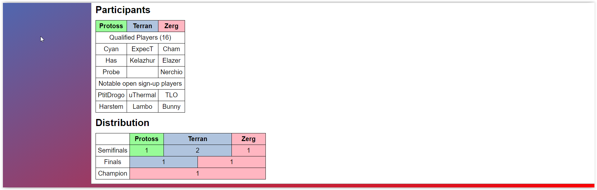

# Oefeningen hoofdstuk 4: CSS Advanced

Download of clone deze repository. Hiervoor klik je op de groene knop.

Pak deze zip uit in de map waar je alle leermateriaal van Webapplicaties I plaatst.

Ga nu naar Visual Studio Code en open deze map.

Er is 1 oefening, bestaande uit drie kleinere oefeningen, waarbij enkele onderdelen uit dit hoofdstuk worden ingeoefend: block-inline - Box model - advanced selectors. Vervolgens zijn er 3 grotere oefeningen, waar alle leerstof ivm CSS aan bod komen.             
Let op: **wijzig niets aan de html bestanden - voeg geen class en/of id attribuut toe aan de html.**

-----
## OEFENING 1: startoefeningen.
Je vindt de oefeningen in de map **StartOefeningen**.

Elke oefening heeft een index.html, die elke oefening meer content bevat. De map css bevat de style.css. 

**01BlockInline**     
Info:
- lettertype: monospace
- kleur: #6789ab;
- lettergrootte: 1.4X groter dan standaard

Hieronder zie je het resultaat in de browser zonder css en het resultaat met css.

Zonder CSS.

Met CSS

----
**02Boxmodel**    
Info:
- lettertype: monospace
- lettergrootte: 1.4X groter dan standaard

Hieronder zie je het resultaat in de browser zonder css en het resultaat met css.

Zonder CSS.

Met CSS

------
**03AdvancedSelectors**    
Info:
- alle info over deze oefening vind je in het css bestand.

Hieronder zie je het resultaat in de browser zonder css en het resultaat met css.

Zonder CSS.

Met CSS

-----
-----
## Oefening 2: Beatles
Deze oefening bevat twee pagina's: index.html en beatles.html. Er wordt gebruik gemaakt van een reset_browser_styles.css.     
Verder is er een main.css. Deze bevat reeds enkele CSS regels. Vul verder aan zodat het eindresultaat er uitziet zoals verder.   
Leg de link naar beide css bestanden in de twee html pagina's.   
Nuttige info:
- beide pagina's zijn gecentreerd en hebben een vaste breedte van 96rem
- kleuren: #fc0000; #003284; #cccccc; white, blue
- alles is van toepassing op beide pagina's. Bij beatles.html wordt de tweede paragraaf verjes weergegeven.

Zonder CSS.

Met CSS

------
## Oefening 3: Likwiepedia
De likwiepedia die in deze oefening gemaakt wordt is een eenvoudigere versie van de Liquipedia pagina voor het WCS Montreal.        

Voeg een kleur gradient toe van links-boven (#1b86e4) naar rechts-onder (red).    
De header en de main hebben een zwarte rand van 1px, margin en padding van 10 px en een witte achtergrond.
De css code die verder toegevoegd wordt slaat op de opmaak van de tables.      

**Eerste tabel - prize pool:**
- Voeg de randen toe. Deze bestaan uit zwarte doorlopende lijnen van 1 pixel breed.
Alle cellen hebben 5 pixels padding. De tekst wordt altijd gecentreerd. Deze opmaak
geldt voor alle tabellen op de pagina.
- Zorg dat de cellen de juiste kleuren krijgen. De rij met de eerste plaats krijgt “gold”
als achtergrondkleur, de tweede plaats krijgt “silver” en de derde plaats “peru”
(“bronze” bestaat namelijk niet).

**Tweede en derde tabel - Participants en Distribution**     
Maak gebruik van advanced selectors (nth-child en/of nth-of-type)en voeg de juiste achtergrondkleur toe:  “palegreen”, “lightsteelblue” en “lightpink”.

Zonder CSS.

Met CSS

Detail van de tabellen

------
## Oefening 4: BolDotCom
De bedoeling van deze oefening is om het registratieformulier van de bol.com webwinkel na te bouwen.

- Opmaak van de header:
    1. Bij de linkerlijst is er 10 pixels padding aan de rechterkant van de list items. Bij de rechterlijst is er evenveel padding, maar aan de linkerkant van de list items. Het lijkt misschien eenvoudiger om voor beide dezelfde padding in te stellen, maar dit ziet er niet even goed uit. Probeer eens, en zie zelf waarom.
    2. Mogelijks is de horizontale lijn die onder de header staat momenteel te kort. Dit is omdat de browser style sheet standaard een margin geeft aan lijsten. Zet deze op 0 en de lijn zou de volledige breedte van de pagina moeten innemen.
- Opmaak van de fieldsets
    1. Standaard tonen browsers een rand rond de fieldsets. Je kan deze verwijderen door het border attribuut op “0” in te stellen.
    2. De fieldsets kleven nu nog aan elkaar. Voeg de juiste soort witruimte (padding of margin) toe om dit te verhelpen.
- Opmaak van de tabel
    1. Zoek zelf uit welke soort rand je moet toevoegen om het resultaat zoals op de eerste pagina te bekomen.
    2. De eerste kolom is 215 pixels breed, de tweede kolom 400 pixels. Tip: colgroup.

- Opmaak "Verzenden" knop. Gebruik hiervoor een attribute selector.
    1. Blauwe achtergrondkleur
    2. Rand van 5 pixels dik
    3. Witte tekstkleur;
    4. 10 pixels padding rondomrond, 10 pixels margin aan de bovenkant.

Zonder CSS.

Met CSS

